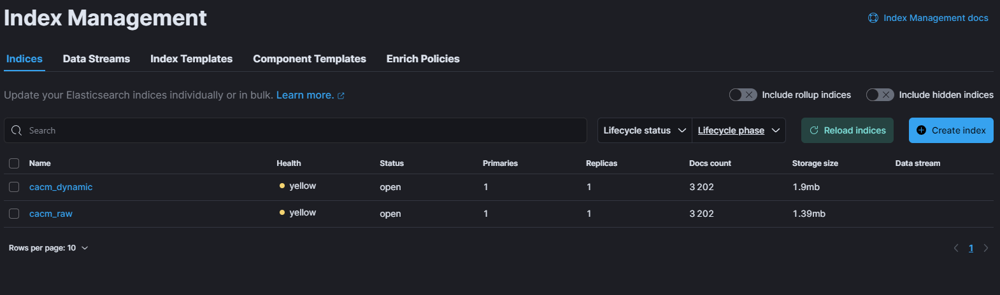
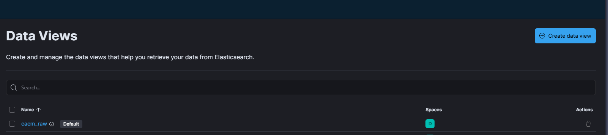
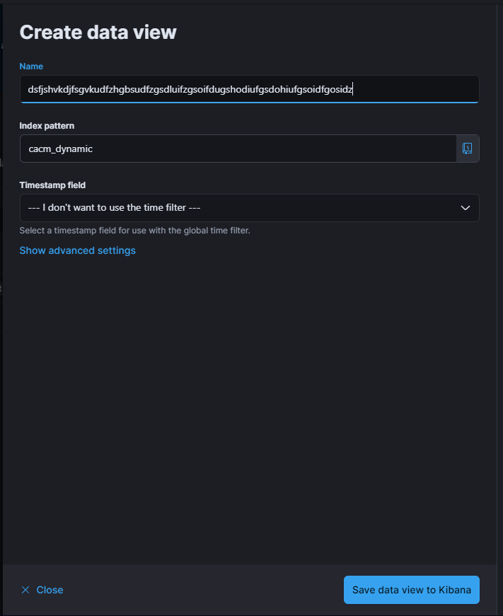

# Lab - O2C - mots - heure

## mise en place 
### terminal 
#### bug 
[https://www.elastic.co/guide/en/elasticsearch/reference/current/docker.html#_set_vm_max_map_count_to_at_least_262144](https://www.elastic.co/guide/en/elasticsearch/reference/current/docker.html#_set_vm_max_map_count_to_at_least_262144)
```bash
wsl -d docker-desktop -u root
```
```bash
sysctl -w vm.max_map_count=262144
```
#### container 
```bash
docker compose up
``` 

### elastic
#### login 
`elastic`
`MAC2024`

#### import
[http://localhost:5601/app/home#/tutorial_directory/fileDataViz](http://localhost:5601/app/home#/tutorial_directory/fileDataViz)
fichier : `cacm.ndjson`
index name : `cacm_raw`

#### console 
[http://localhost:5601/app/dev_tools#/console](http://localhost:5601/app/dev_tools#/console)

```bash
PUT _ingest/pipeline/cacm_ingest
{
  "processors": [
    {
      "csv": {
        "field": "_row",
        "target_fields": [
          "id",
          "author",
          "title",
          "date",
          "summary"
        ],
        "separator": "\t",
        "quote": "§"
      }
    },
    {
      "split": {
        "field": "author",
        "separator": ";",
        "ignore_missing": true
      }
    },
    {
      "remove": {
        "field": "_row"
      }
    }
  ]
}
```

```bash
POST _reindex
{
  "source": {
    "index": "cacm_raw"
  },
  "dest": {
    "index": "cacm_dynamic",
    "pipeline": "cacm_ingest"
  }
}
```

résultat :
[http://localhost:5601/app/management/data/index_management/indices](http://localhost:5601/app/management/data/index_management/indices)



### Création de la vue :
[http://localhost:5601/app/management/kibana/dataViews](http://localhost:5601/app/management/kibana/dataViews)


- bouton tout à droite
  - index pattern : `cacm_dynamic`
  - Timestamp field : séléctionner : `I don’t want to use the time filter`


bouton en bas

#### commandes (pour l'intro) :
[http://localhost:5601/app/discover#/?_g=(time:(from:now-15m,to:now))&_a=(columns:!(author.keyword),filters:!(),index:'0e92f21e-07b7-4e0b-8516-312965ea1923',interval:auto,query:(language:kuery,query:''),sort:!())](http://localhost:5601/app/discover#/?_g=(time:(from:now-15m,to:now))&_a=(columns:!(author.keyword),filters:!(),index:'0e92f21e-07b7-4e0b-8516-312965ea1923',interval:auto,query:(language:kuery,query:''),sort:!()))

in `Filter your data using KQL syntax` :
What percentage of documents have a summary field? `summary:*`
How many document have at least one author? `author:*`
How many document have been published after 1975? `date > "1975-01-01"`
mais after est pas clair... ça veut dire après que l'annéé soit finie ou pas ?

HF